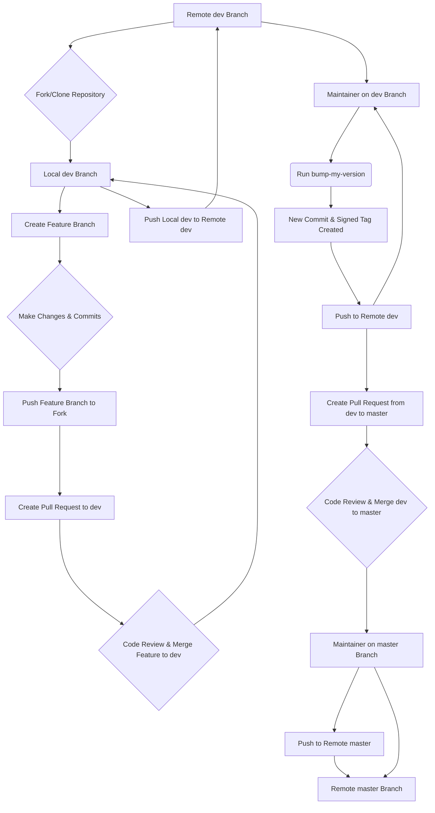

# Contributing to pyTelegramDialogsMirror

First off, thank you for considering contributing! All contributions you make are **greatly appreciated**.

This document provides a comprehensive guide for developers to ensure a smooth and consistent workflow.

## Outline

1.  [Setting Up Your Development Environment](#1-setting-up-your-development-environment)
2.  [Commit Message Guidelines](#2-commit-message-guidelines)
3.  [The Release Process (For Maintainers)](#3-the-release-process-for-maintainers)
4.  [Development Workflow Diagram](#4-development-workflow-diagram)
5.  [Project Structure](#5-project-structure)

## 1. Setting Up Your Development Environment

Follow these steps to get your local development environment running.

### Step 1: Fork and Clone the Repository

1.  **Fork** the repository on GitHub.
2.  **Clone** your forked repository to your local machine:
    ```bash
    git clone https://github.com/YOUR_USERNAME/pyTelegramDialogsMirror.git
    cd pyTelegramDialogsMirror
    ```

### Step 2: Create a Virtual Environment

Create and activate a Python virtual environment to isolate project dependencies.

```bash
python3 -m venv env
source env/bin/activate
# On Windows, use: env\Scripts\activate
```

### Step 3: Install Dependencies

This project uses two requirements files:
- `requirements.txt`: Contains the core dependencies for running the application.
- `requirements-dev.txt`: Includes all core dependencies plus the tools needed for development, such as `bump-my-version`.

Install all development dependencies with the following command:
```bash
pip install -r requirements-dev.txt
```

### Step 4: Environment Variable Configuration

The application is configured via environment variables, which are loaded from a `.env` file. This allows for a flexible setup without hardcoding credentials or settings.

**Setup**

First, copy the example file:
```bash
cp env_example.txt .env
```
Then, edit the `.env` file to set the following variables:

**Required Variables**

- `API_ID`: Your Telegram application ID.
- `API_HASH`: Your Telegram application hash.
- `CHANNEL_MAPPINGS_STR`: Defines the source and target dialogs for mirroring. The format is a semicolon-separated list of comma-separated pairs: `SOURCE_ID_1,TARGET_ID_1;SOURCE_ID_2,TARGET_ID_2`.

> **Note:** You can obtain your `API_ID` and `API_HASH` by logging into your Telegram account at [my.telegram.org](https://my.telegram.org) and navigating to the "API development tools" section.

**Optional Variables**

These variables have default values but can be overridden in your `.env` file for custom behavior.

- **Application Identity**
  - `APP_NAME`: The name for the session file. **Default:** `pyTelegramDialogsMirror`.
  - `DEVICE_MODEL`: The device model reported to Telegram. **Default:** `pyTelegramDialogsMirror`.
  - `LANG_CODE`: The language code sent to Telegram. **Default:** `ru`.

- **Performance & Rate Limiting**
  - `SEND_DELAY`: The delay in seconds between sending messages to avoid flooding. **Default:** `0.8`.
  - `BATCH_SIZE`: The number of messages to fetch in a single batch during history synchronization. **Default:** `150`.
  - `MAX_CACHE_SIZE`: The maximum number of dialog names to keep in the LRU cache. **Default:** `200`.

- **Network & Retries**
  - `REQUEST_RETRIES`: The number of times to retry a failed Telegram API request. **Default:** `9`.
  - `CONNECTION_RETRIES`: The number of times to retry connecting to Telegram. **Default:** `9`.
  - `RETRY_DELAY`: The delay in seconds between retries. **Default:** `36`.
  - `AUTO_RECONNECT`: Whether to automatically reconnect if the client is disconnected. **Default:** `True`.

- **Advanced Error Handling & Retries**
  - `SKIP_SERVICE_MESSAGES`: When `True`, the application will automatically identify and skip forwarding "service messages" (e.g., "User joined," "Group photo updated"). This is highly recommended as these messages have no content to forward and would otherwise cause a `MediaEmptyError`. **Default:** `True`.
  - `MAX_RETRIES`: The maximum number of times to retry a failed API call (like forwarding a message) before giving up. This applies to recoverable errors like network issues or temporary Telegram problems. **Default:** `5`.
  - `BACKOFF_FACTOR`: A multiplier that controls the delay between retries. The delay is calculated as `BACKOFF_FACTOR * (2 ** attempt_number)`. A higher factor increases the wait time. For example, with a factor of `1.0`, the delays will be 1s, 2s, 4s, 8s, and so on. **Default:** `1.0`.

- **Logging**
  - `LOG_TELETHON_DIFFERENCES`: Whether to log update differences from Telethon. Can be very verbose. **Default:** `True`.
  - `RECEIVE_UPDATES`: Whether the client should receive updates from Telegram. **Default:** `True`.

- **Timezone Configuration**
  - `TIMEZONE`: Sets the timezone for the datetime displayed in forwarded messages. This allows you to see timestamps in your local time instead of the default UTC. The value can be a standard timezone name (e.g., 'Europe/Moscow') or a UTC offset (e.g., '+03:00').
    - **Default:** `UTC`
    - **Examples:**
      - `TIMEZONE="Europe/Berlin"`
      - `TIMEZONE="America/New_York"`
      - `TIMEZONE="+05:30"`

## 2. Commit Message Guidelines

This project enforces the [Conventional Commits](https://www.conventionalcommits.org/en/v1.0.0/) specification. Adhering to this standard is crucial for maintaining a readable and structured Git history, and it is essential for the automated generation of changelogs for each release.

### The Anatomy of a Commit Message

A commit message must be structured as follows:

```
<type>(<scope>): <subject>

<body>

<footer>
```

- **Header:** The first line, containing the `type`, `scope`, and `subject`. It is mandatory and must not exceed 72 characters.
- **Body:** An optional, longer description of the changes. It must be separated from the header by a blank line.
- **Footer:** An optional section for referencing issue numbers or declaring breaking changes.

### Header Components

#### Type

This defines the category of the change. It must be one of the following:

- **feat:** A new feature for the user.
- **fix:** A bug fix for the user.
- **docs:** Changes to documentation only.
- **style:** Code style changes that do not affect meaning (e.g., formatting, white-space).
- **refactor:** A code change that neither fixes a bug nor adds a feature.
- **perf:** A code change that improves performance.
- **test:** Adding missing tests or correcting existing ones.
- **chore:** Changes to the build process, auxiliary tools, or other tasks that don't modify src or test files.

#### Scope (Optional)

The scope provides context for the change. It should be a noun describing the part of the codebase affected.

- **Examples:** `forwarder`, `config`, `release`, `versioning`, `deps`

#### Subject

The subject is a concise, imperative-tense summary of the change.

- **Do:** `add support for video messages`
- **Don't:** `Added support for video messages` or `Adds support for video messages`
- Keep it short and to the point.

### Body (Optional)

The body is used to explain the *what* and *why* of the change, not the *how*. It should provide context that the code alone cannot.

- Use it to explain the problem, the solution, and any alternatives considered.
- Use bullet points for longer descriptions.

### Footer (Optional)

- **Breaking Changes:** If your commit introduces a breaking change, the footer must start with `BREAKING CHANGE:`, followed by a description of the change, the justification, and any migration notes.
- **Referencing Issues:** Close issues by using keywords like `Closes #123`.

### Examples of Good Commit Messages

**A New Feature:**
```
feat(synchronizer): add option to sync messages by date range

Implement a new `--since` and `--until` flag for the `copy` command.
This allows users to perform partial synchronizations instead of having to copy the entire history every time.
```

**A Bug Fix:**
```
fix(forwarder): prevent crash when message has no text

Previously, the application would raise a `TypeError` if a message
(e.g., a sticker or photo) was received without any text content.

This change adds a check to ensure the message text exists before
attempting to process it, preventing the crash.

Closes #42
```

**Documentation Update:**
```
docs: overhaul and detail contributing guide

Rewrite the `CONTRIBUTING.md` to provide a comprehensive, step-by-step guide for both new contributors and maintainers.
```

**A Breaking Change:**
```
refactor(config): rename API_ID and API_HASH to TELEGRAM_API_ID and TELEGRAM_API_HASH

BREAKING CHANGE: The environment variables for Telegram API credentials have been renamed to avoid potential conflicts with other libraries.

Users must update their `.env` files:
- `API_ID` is now `TELEGRAM_API_ID`
- `API_HASH` is now `TELEGRAM_API_HASH`
```

## 3. The Release Process (For Maintainers)

Creating a new release involves bumping the version number and creating a GPG-signed Git tag. This process is critical for the project's security and integrity.

**Why GPG Signing?**

A GPG signature on a Git tag provides a cryptographic guarantee that the tag was created by a trusted maintainer and that the code has not been altered since it was signed. This allows users of the project to verify the authenticity of a release before they download and run it.

**How it Works with `bump-my-version`**

Our release workflow is streamlined by `bump-my-version`. When you run the `bump-my-version` command:
1.  It reads the `pyproject.toml` file to determine the current version and how to increment it.
2.  It automatically updates the version number in the configured files (`VERSION` and `pyproject.toml`).
3.  It creates a Git commit with these changes.
4.  Crucially, because `sign_tags = true` is set in our configuration, it instructs Git to create a new tag and sign it using the GPG key you have configured in your local Git environment.

This means that the entire release process is handled by a single command, ensuring consistency and security.

Only project maintainers should perform these steps.

### Step 1: GPG Key Setup

If you don't have a GPG key, you'll need to create one.

**A. Install GPG**

- **macOS:**
  - **Using [Homebrew](https://brew.sh/):** (Recommended)
    ```bash
    brew install gnupg
    ```
  - **Using [MacPorts](https://www.macports.org/):**
    ```bash
    sudo port install gnupg2
    ```

- **Linux:**
  - **Debian / Ubuntu / Mint:**
    ```bash
    sudo apt-get update
    sudo apt-get install gnupg
    ```
  - **Fedora / CentOS / RHEL:**
    ```bash
    sudo dnf install gnupg2
    ```
  - **Arch Linux:**
    ```bash
    sudo pacman -S gnupg
    ```

- **Windows:**
  - **Using [Gpg4win](https://www.gpg4win.org/):** (Recommended)
    Download and run the installer from the official website. This package includes GnuPG, a certificate manager, and a secure email client.
  - **Using [Chocolatey](https://chocolatey.org/):**
    ```bash
    choco install gpg4win
    ```

**B. Generate a New GPG Key**

Run the following command to start the key generation process:
```bash
gpg --full-generate-key
```
- When prompted, select the default key type (`RSA and RSA`).
- Choose a key size of `4096` bits.
- Specify an expiration date (e.g., `1y` for one year) or select no expiration.
- Enter your real name and email address. **It is strongly recommended to use your public-facing GitHub no-reply email address**, which you can find in your [GitHub email settings](https://github.com/settings/emails).

**C. Add Your GPG Key to GitHub**

1.  List your GPG keys to find the ID of the one you just created:
    ```bash
    gpg --list-secret-keys --keyid-format=long
    ```
2.  From the output, copy the key ID. It's the long string after `rsa4096/`.
    ```
    sec   rsa4096/YOUR_KEY_ID 2025-07-23 [SC]
    ```
3.  Export your public key using your key ID:
    ```bash
    gpg --armor --export YOUR_KEY_ID
    ```
4.  Copy the entire output, starting with `-----BEGIN PGP PUBLIC KEY BLOCK-----`.
5.  Go to your [GPG keys settings on GitHub](https://github.com/settings/keys), click **New GPG key**, and paste your key.

**D. Configure Git**

Tell Git which key to use for signing:
```bash
git config --global user.signingkey YOUR_KEY_ID
```

### Step 2: Create the New Version

Ensure you are on the `dev` branch and have the latest changes from the remote repository.

```bash
git checkout dev
git pull origin dev
```

Use `bump-my-version` to increment the version. The tool will automatically update the necessary files, create a commit, and generate a signed tag.

- **For a patch release (e.g., 1.0.0 -> 1.0.1):**
  ```bash
  bump-my-version bump patch
  ```
- **For a minor release (e.g., 1.0.0 -> 1.1.0):**
  ```bash
  bump-my-version bump minor
  ```
- **For a major release (e.g., 1.0.0 -> 2.0.0):**
  ```bash
  bump-my-version bump major
  ```

### Step 3: Verifying Tags

After creating a release, it is crucial to verify the tag to ensure it was created and signed correctly. 

**Listing All Tags**

To see a list of all local tags, you can use:
```bash
git tag
```
This will show a simple list of tag names, including the one you just created.

**Inspecting a Tag**

To get detailed information, use `git show <tag-name>`. Because our process creates **annotated tags**, the output will contain metadata separate from the commit itself. This is a key security feature.

**Example of a Correctly Signed Tag**

The output for a signed annotated tag has two parts:
1.  The **tag object**, which includes the `Tagger` info and the GPG signature block.
2.  The **commit object**, which the tag points to, showing the `Author` and the code changes.

```bash
$ git show v1.5.6

tag v1.5.6
Tagger: Example User <example@users.noreply.github.com>
Date:   Wed Jul 24 10:00:00 2025 +0300

Bump version: 1.5.5 → 1.5.6

-----BEGIN PGP SIGNATURE-----

[GENERIC EXAMPLE GPG SIGNATURE BLOCK - DO NOT USE ORIGINAL IN PRODUCTION]

-----END PGP SIGNATURE-----

commit 8bffd5d92c646d0dab7f8cdc7cc806609f88bb99
Author: Example User <example@users.noreply.github.com>
Date:   Wed Jul 24 10:00:00 2025 +0300

    Bump version: 1.5.5 → 1.5.6
```

The presence of the `-----BEGIN PGP SIGNATURE-----` block on the **tag object** is the confirmation that the release is authentic.

**Forcing a Local GPG Verification**

To be absolutely certain, you can use the `--verify` flag. This command will produce output only if the tag is invalid or unsigned. A valid signed tag will produce no output.

```bash
# No output means the signature is valid and trusted
git tag --verify v1.5.6
```

### Step 4: Push to Remote

Push the new commit and the tag to the remote repository. Using `--follow-tags` ensures that the tag created by `bump-my-version` is pushed along with the commit.
```bash
git push --follow-tags origin dev
```

### Versioning Workflow for Developers

This project utilizes an automated versioning and changelog generation workflow, primarily managed on the `dev` branch.

**1. Development on `dev` Branch:**
   - All new features, bug fixes, and other changes are developed on feature branches and merged into the `dev` branch.
   - Commit messages **must** adhere to the [Conventional Commits](#2-commit-message-guidelines) specification. This is crucial for automated changelog generation.

**2. Bumping Version on `dev`:**
   - When the `dev` branch is stable and ready for a new release (e.g., for a patch, minor, or major update), the version bump is performed directly on the `dev` branch.
   - Use the `versioning/release.py` script to automate this process:
     ```bash
     python versioning/release.py <patch|minor|major>
     ```
     - This script will:
       - Execute `bump-my-version` to update `pyproject.toml` and `versioning/VERSION`.
       - Generate new changelog entries based on recent Conventional Commits using `git-changelog`.
       - Update the `changelog.md` file in the project root.
       - Amend the `bump-my-version` commit with the changelog changes, ensuring a single, atomic commit for the release.
       - Push the `dev` branch and the newly created GPG-signed tag to the remote `origin/dev`.

**3. Merging `dev` to `master` for Releases:**
   - Once the `dev` branch has been bumped and pushed, and the release is verified, it is merged into the `master` branch.
   - This merge should typically be a fast-forward merge if no direct commits have been made to `master` since the last release.
   - After merging, the `master` branch should also be pushed to `origin/master`.

This workflow ensures that `dev` always contains the latest development, and `master` always reflects stable, released versions with corresponding changelog entries and signed tags.

## 4. Development Workflow Diagram

The following diagram illustrates the typical workflow for contributing to the project, from feature development to release.



## 5. Project Structure

This project is organized into functional modules to ensure clarity and separation of concerns.

```

# 1. Core Application Logic
app/
├── launcher.py      # Main application orchestrator; starts the client and services.
├── client.py        # The main Telethon client wrapper.
├── forwarder.py     # Handles live message forwarding between dialogs.
├── synchronizer.py  # Handles the --copy mode for synchronizing message history.
├── stats.py         # Manages and displays session statistics.
├── cache.py         # Manages caching of dialog names to reduce API calls.
├── arguments.py     # Defines and parses command-line arguments.
└── utils.py         # Utility functions used across the application.

# 2. Configuration
config/
├── config.py        # Pydantic settings class for managing configuration from .env.
└── logger.py        # Configures the Loguru logging setup.

.env                 # Private environment variables (API keys, etc.). Not version controlled.
env_example.txt      # An example .env file for users to copy.

# 3. Application Entry Point
main.py              # The main entry point for the application.

# 4. Dependencies & Versioning
requirements.txt     # Production dependencies for end-users.
requirements-dev.txt # All dependencies for developers.
pyproject.toml       # Project metadata and configuration for tools like bump-my-version.
VERSION              # A single file containing the current version number.

# 5. Documentation & Community
README.md            # The main user-facing documentation.
CONTRIBUTING.md      # This file: developer-facing documentation.
changelog.md         # A manually maintained changelog.
LICENSE              # The project's license file.
docs/                # Supporting documentation files and images.

# 6. Runtime Data (Generated by the application)
sessions/            # Stores Telethon session files for authentication.
Logs/                # Directory for log files generated by the application.
cache/               # Stores cached data, such as message IDs.

# 7. Git Configuration
.gitignore           # Specifies files and directories to be ignored by Git.
.gitmessage          # A template for Git commit messages (used internally).

```
