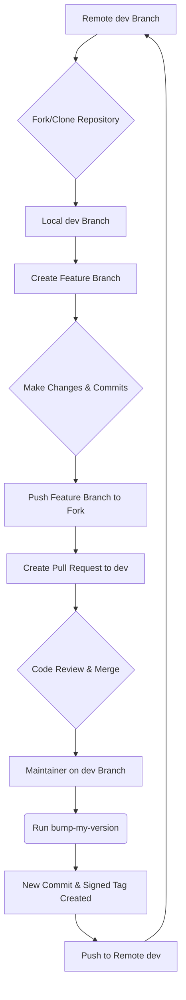

# Contributing to pyTelegramDialogsMirror

First off, thank you for considering contributing! All contributions you make are **greatly appreciated**.

This document provides a comprehensive guide for developers to ensure a smooth and consistent workflow.

## 1. Setting Up Your Development Environment

Follow these steps to get your local development environment running.

### Step 1: Fork and Clone the Repository

1.  **Fork** the repository on GitHub.
2.  **Clone** your forked repository to your local machine:
    ```bash
    git clone https://github.com/YOUR_USERNAME/pyTelegramDialogsMirror.git
    cd pyTelegramDialogsMirror
    ```

### Step 2: Create a Virtual Environment

Create and activate a Python virtual environment to isolate project dependencies.

```bash
python3 -m venv env
source env/bin/activate
# On Windows, use: env\Scripts\activate
```

### Step 3: Install Dependencies

This project uses two requirements files:
- `requirements.txt`: Contains the core dependencies for running the application.
- `requirements-dev.txt`: Includes all core dependencies plus the tools needed for development, such as `bump-my-version`.

Install all development dependencies with the following command:
```bash
pip install -r requirements-dev.txt
```

### Step 4: Configure Environment Variables

Copy the example environment file and fill in your credentials.
```bash
cp env_example.txt .env
```
Now, edit the `.env` file to add your Telegram `API_ID` and `API_HASH`.

> **Note:** You can obtain your `API_ID` and `API_HASH` by logging into your Telegram account at [my.telegram.org](https://my.telegram.org) and navigating to the "API development tools" section.

## 2. Commit Message Guidelines

This project enforces the [Conventional Commits](https://www.conventionalcommits.org/en/v1.0.0/) specification. Adhering to this standard is crucial for maintaining a readable and structured Git history, and it is essential for the automated generation of changelogs for each release.

### The Anatomy of a Commit Message

A commit message must be structured as follows:

```
<type>(<scope>): <subject>

<body>

<footer>
```

- **Header:** The first line, containing the `type`, `scope`, and `subject`. It is mandatory and must not exceed 72 characters.
- **Body:** An optional, longer description of the changes. It must be separated from the header by a blank line.
- **Footer:** An optional section for referencing issue numbers or declaring breaking changes.

### Header Components

#### Type

This defines the category of the change. It must be one of the following:

- **feat:** A new feature for the user.
- **fix:** A bug fix for the user.
- **docs:** Changes to documentation only.
- **style:** Code style changes that do not affect meaning (e.g., formatting, white-space).
- **refactor:** A code change that neither fixes a bug nor adds a feature.
- **perf:** A code change that improves performance.
- **test:** Adding missing tests or correcting existing ones.
- **chore:** Changes to the build process, auxiliary tools, or other tasks that don't modify src or test files.

#### Scope (Optional)

The scope provides context for the change. It should be a noun describing the part of the codebase affected.

- **Examples:** `forwarder`, `config`, `release`, `versioning`, `deps`

#### Subject

The subject is a concise, imperative-tense summary of the change.

- **Do:** `add support for video messages`
- **Don't:** `Added support for video messages` or `Adds support for video messages`
- Keep it short and to the point.

### Body (Optional)

The body is used to explain the *what* and *why* of the change, not the *how*. It should provide context that the code alone cannot.

- Use it to explain the problem, the solution, and any alternatives considered.
- Use bullet points for longer descriptions.

### Footer (Optional)

- **Breaking Changes:** If your commit introduces a breaking change, the footer must start with `BREAKING CHANGE:`, followed by a description of the change, the justification, and any migration notes.
- **Referencing Issues:** Close issues by using keywords like `Closes #123`.

### Examples of Good Commit Messages

**A New Feature:**
```
feat(synchronizer): add option to sync messages by date range

Implement a new `--since` and `--until` flag for the `copy` command.
This allows users to perform partial synchronizations instead of having to copy the entire history every time.
```

**A Bug Fix:**
```
fix(forwarder): prevent crash when message has no text

Previously, the application would raise a `TypeError` if a message
(e.g., a sticker or photo) was received without any text content.

This change adds a check to ensure the message text exists before
attempting to process it, preventing the crash.

Closes #42
```

**Documentation Update:**
```
docs: overhaul and detail contributing guide

Rewrite the `CONTRIBUTING.md` to provide a comprehensive, step-by-step guide for both new contributors and maintainers.
```

**A Breaking Change:**
```
refactor(config): rename API_ID and API_HASH to TELEGRAM_API_ID and TELEGRAM_API_HASH

BREAKING CHANGE: The environment variables for Telegram API credentials have been renamed to avoid potential conflicts with other libraries.

Users must update their `.env` files:
- `API_ID` is now `TELEGRAM_API_ID`
- `API_HASH` is now `TELEGRAM_API_HASH`
```

## 3. The Release Process (For Maintainers)

Creating a new release involves bumping the version number and creating a GPG-signed Git tag. This process is critical for the project's security and integrity.

**Why GPG Signing?**

A GPG signature on a Git tag provides a cryptographic guarantee that the tag was created by a trusted maintainer and that the code has not been altered since it was signed. This allows users of the project to verify the authenticity of a release before they download and run it.

**How it Works with `bump-my-version`**

Our release workflow is streamlined by `bump-my-version`. When you run the `bump-my-version` command:
1.  It reads the `pyproject.toml` file to determine the current version and how to increment it.
2.  It automatically updates the version number in the configured files (`VERSION` and `pyproject.toml`).
3.  It creates a Git commit with these changes.
4.  Crucially, because `sign_tags = true` is set in our configuration, it instructs Git to create a new tag and sign it using the GPG key you have configured in your local Git environment.

This means that the entire release process is handled by a single command, ensuring consistency and security.

Only project maintainers should perform these steps.

### Step 1: GPG Key Setup

If you don't have a GPG key, you'll need to create one.

**A. Install GPG**

- **macOS:**
  - **Using [Homebrew](https://brew.sh/):** (Recommended)
    ```bash
    brew install gnupg
    ```
  - **Using [MacPorts](https://www.macports.org/):**
    ```bash
    sudo port install gnupg2
    ```

- **Linux:**
  - **Debian / Ubuntu / Mint:**
    ```bash
    sudo apt-get update
    sudo apt-get install gnupg
    ```
  - **Fedora / CentOS / RHEL:**
    ```bash
    sudo dnf install gnupg2
    ```
  - **Arch Linux:**
    ```bash
    sudo pacman -S gnupg
    ```

- **Windows:**
  - **Using [Gpg4win](https://www.gpg4win.org/):** (Recommended)
    Download and run the installer from the official website. This package includes GnuPG, a certificate manager, and a secure email client.
  - **Using [Chocolatey](https://chocolatey.org/):**
    ```bash
    choco install gpg4win
    ```

**B. Generate a New GPG Key**

Run the following command to start the key generation process:
```bash
gpg --full-generate-key
```
- When prompted, select the default key type (`RSA and RSA`).
- Choose a key size of `4096` bits.
- Specify an expiration date (e.g., `1y` for one year) or select no expiration.
- Enter your real name and email address. **It is strongly recommended to use your public-facing GitHub no-reply email address**, which you can find in your [GitHub email settings](https://github.com/settings/emails).

**C. Add Your GPG Key to GitHub**

1.  List your GPG keys to find the ID of the one you just created:
    ```bash
    gpg --list-secret-keys --keyid-format=long
    ```
2.  From the output, copy the key ID. It's the long string after `rsa4096/`.
    ```
    sec   rsa4096/YOUR_KEY_ID 2025-07-23 [SC]
    ```
3.  Export your public key using your key ID:
    ```bash
    gpg --armor --export YOUR_KEY_ID
    ```
4.  Copy the entire output, starting with `-----BEGIN PGP PUBLIC KEY BLOCK-----`.
5.  Go to your [GPG keys settings on GitHub](https://github.com/settings/keys), click **New GPG key**, and paste your key.

**D. Configure Git**

Tell Git which key to use for signing:
```bash
git config --global user.signingkey YOUR_KEY_ID
```

### Step 2: Create the New Version

Ensure you are on the `dev` branch and have the latest changes from the remote repository.

```bash
git checkout dev
git pull origin dev
```

Use `bump-my-version` to increment the version. The tool will automatically update the necessary files, create a commit, and generate a signed tag.

- **For a patch release (e.g., 1.0.0 -> 1.0.1):**
  ```bash
  bump-my-version patch
  ```
- **For a minor release (e.g., 1.0.0 -> 1.1.0):**
  ```bash
  bump-my-version minor
  ```
- **For a major release (e.g., 1.0.0 -> 2.0.0):**
  ```bash
  bump-my-version major
  ```

### Step 3: Verify the Signed Tag

You can check that the new tag was created and signed correctly.
```bash
# Replace v1.5.6 with the new version tag
git show v1.5.6
```
The output should include a `gpg` signature block.

### Step 4: Push to Remote

Push the new commit and the tag to the remote repository. Using `--follow-tags` ensures that the tag created by `bump-my-version` is pushed along with the commit.
```bash
git push --follow-tags origin dev
```

## 4. Development Workflow Diagram

The following diagram illustrates the typical workflow for contributing to the project.



## 5. Project Structure

The project is organized to separate concerns and make the codebase easy to navigate:

```
.env                 # Your private environment variables
.gitignore           # Git ignore file
README.md            # Main user-facing documentation
CONTRIBUTING.md      # This file: developer-facing documentation
requirements.txt     # Production dependencies for end-users
requirements-dev.txt # All dependencies for developers
main.py              # Minimalist application entry point

app/                 # Core application logic
├── launcher.py      # Main application orchestrator
├── forwarder.py     # Handles live message forwarding
└── ...              # Other core modules

config/              # Configuration management
├── config.py        # Pydantic settings class
└── logger.py        # Logging configuration

Logs/                # Directory for log files
sessions/            # Directory for Telethon session files
cache/               # Directory for cached message data
```