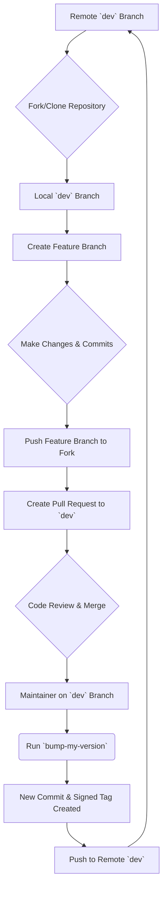

# Contributing to pyTelegramDialogsMirror

First off, thank you for considering contributing! All contributions you make are **greatly appreciated**.

This document provides a comprehensive guide for developers to ensure a smooth and consistent workflow.

## 1. Setting Up Your Development Environment

Follow these steps to get your local development environment running.

### Step 1: Fork and Clone the Repository

1.  **Fork** the repository on GitHub.
2.  **Clone** your forked repository to your local machine:
    ```bash
    git clone https://github.com/YOUR_USERNAME/pyTelegramDialogsMirror.git
    cd pyTelegramDialogsMirror
    ```

### Step 2: Create a Virtual Environment

Create and activate a Python virtual environment to isolate project dependencies.

```bash
python3 -m venv env
source env/bin/activate
# On Windows, use: env\Scripts\activate
```

### Step 3: Install Dependencies

This project uses two requirements files:
- `requirements.txt`: Contains the core dependencies for running the application.
- `requirements-dev.txt`: Includes all core dependencies plus the tools needed for development, such as `bump-my-version`.

Install all development dependencies with the following command:
```bash
pip install -r requirements-dev.txt
```

### Step 4: Configure Environment Variables

Copy the example environment file and fill in your credentials.
```bash
cp env_example.txt .env
```
Now, edit the `.env` file to add your Telegram `API_ID` and `API_HASH`.

## 2. Commit Message Guidelines

This project follows the [Conventional Commits](https://www.conventionalcommits.org/) specification. This format makes the commit history readable and enables automated changelog generation.

Each commit message should be structured as follows:
```
<type>[optional scope]: <description>

[optional body]

[optional footer]
```

- **Type**: Must be one of `feat`, `fix`, `docs`, `style`, `refactor`, `perf`, `test`, or `chore`.

**Example:**
```
feat(forwarder): add support for forwarding stickers
```

## 3. The Release Process (For Maintainers)

Creating a new release involves bumping the version number and creating a GPG-signed Git tag. This process enhances security by allowing users to verify that releases are authentic.

Only project maintainers should perform these steps.

### Step 1: GPG Key Setup

If you don't have a GPG key, you'll need to create one.

**A. Install GPG**

- **macOS (using Homebrew):**
  ```bash
  brew install gnupg
  ```
- **Debian/Ubuntu:**
  ```bash
  sudo apt-get update
  sudo apt-get install gnupg
  ```
- **Windows:** Download and install [Gpg4win](https://www.gpg4win.org/).

**B. Generate a New GPG Key**

Run the following command to start the key generation process:
```bash
gpg --full-generate-key
```
- When prompted, select the default key type (`RSA and RSA`).
- Choose a key size of `4096` bits.
- Specify an expiration date (e.g., `1y` for one year) or select no expiration.
- Enter your real name and email address. **It is strongly recommended to use your public-facing GitHub no-reply email address**, which you can find in your [GitHub email settings](https://github.com/settings/emails).

**C. Add Your GPG Key to GitHub**

1.  List your GPG keys to find the ID of the one you just created:
    ```bash
    gpg --list-secret-keys --keyid-format=long
    ```
2.  From the output, copy the key ID. It's the long string after `rsa4096/`.
    ```
    sec   rsa4096/YOUR_KEY_ID 2025-07-23 [SC]
    ```
3.  Export your public key using your key ID:
    ```bash
    gpg --armor --export YOUR_KEY_ID
    ```
4.  Copy the entire output, starting with `-----BEGIN PGP PUBLIC KEY BLOCK-----`.
5.  Go to your [GPG keys settings on GitHub](https://github.com/settings/keys), click **New GPG key**, and paste your key.

**D. Configure Git**

Tell Git which key to use for signing:
```bash
git config --global user.signingkey YOUR_KEY_ID
```

### Step 2: Create the New Version

Ensure you are on the `dev` branch and have the latest changes from the remote repository.

```bash
git checkout dev
git pull origin dev
```

Use `bump-my-version` to increment the version. The tool will automatically update the necessary files, create a commit, and generate a signed tag.

- **For a patch release (e.g., 1.0.0 -> 1.0.1):**
  ```bash
  bump-my-version patch
  ```
- **For a minor release (e.g., 1.0.0 -> 1.1.0):**
  ```bash
  bump-my-version minor
  ```
- **For a major release (e.g., 1.0.0 -> 2.0.0):**
  ```bash
  bump-my-version major
  ```

### Step 3: Verify the Signed Tag

You can check that the new tag was created and signed correctly.
```bash
# Replace v1.5.6 with the new version tag
git show v1.5.6
```
The output should include a `gpg` signature block.

### Step 4: Push to Remote

Push the new commit and the tag to the remote repository. Using `--follow-tags` ensures that the tag created by `bump-my-version` is pushed along with the commit.
```bash
git push --follow-tags origin dev
```

## 4. Development Workflow Diagram

The following diagram illustrates the typical workflow for contributing to the project.



## 5. Project Structure

The project is organized to separate concerns and make the codebase easy to navigate:

```
.env                 # Your private environment variables
.gitignore           # Git ignore file
README.md            # Main user-facing documentation
CONTRIBUTING.md      # This file: developer-facing documentation
requirements.txt     # Production dependencies for end-users
requirements-dev.txt # All dependencies for developers
main.py              # Minimalist application entry point

app/                 # Core application logic
├── launcher.py      # Main application orchestrator
├── forwarder.py     # Handles live message forwarding
└── ...              # Other core modules

config/              # Configuration management
├── config.py        # Pydantic settings class
└── logger.py        # Logging configuration

Logs/                # Directory for log files
sessions/            # Directory for Telethon session files
cache/               # Directory for cached message data
```